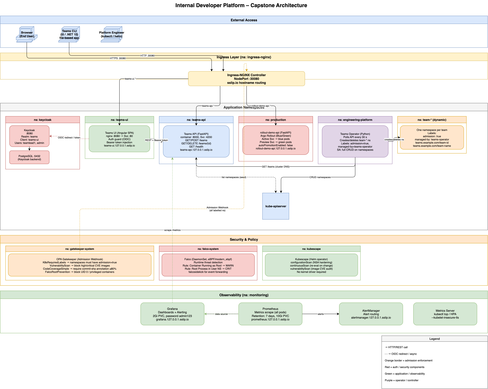
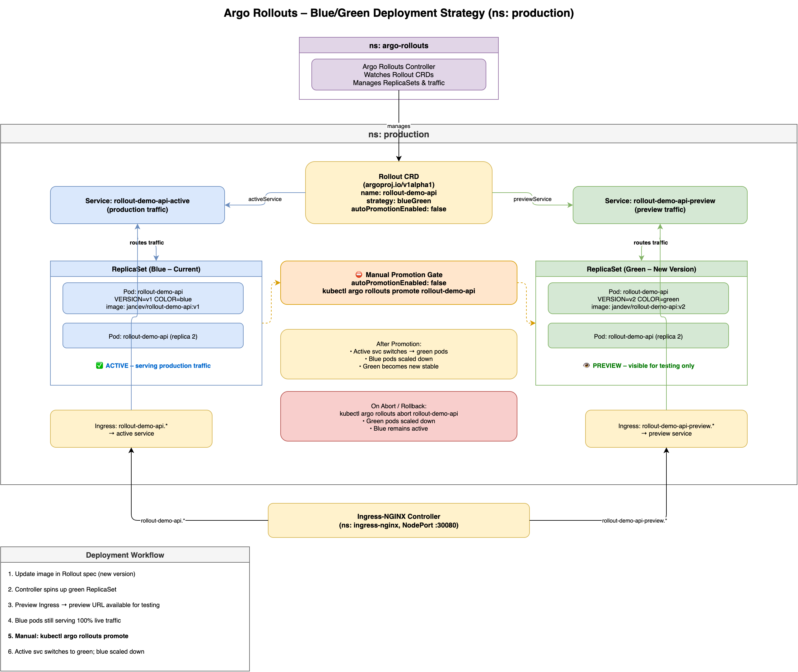

# Capstone Project – Architecture Documentation

This folder contains architecture diagrams for the Internal Developer Platform Capstone project.
The diagrams complement the written context in the [capstone-project README](../README.md).

## Diagrams

| File                                                                       | Description                                                                 |
| -------------------------------------------------------------------------- | --------------------------------------------------------------------------- |
| [images/platform-architecture.drawio](images/platform-architecture.drawio) | Full platform view — all components, namespaces, and their connections      |
| [images/platform-architecture.png](images/platform-architecture.png)       | Exported PNG of the platform architecture diagram                           |
| [images/argo-rollouts.drawio](images/argo-rollouts.drawio)                 | Blue/Green rollout strategy — services, ReplicaSets, and promotion workflow |
| [images/argo-rollouts.png](images/argo-rollouts.png)                       | Exported PNG of the Argo Rollouts diagram                                   |

> To regenerate the PNG exports after editing a `.drawio` file, run `images/export-png.sh`
> (requires [Draw.io desktop](https://github.com/jgraph/drawio-desktop/releases): `brew install --cask drawio`).

---

## Platform Architecture



The platform is organised into four horizontal layers.

### 1. External Access

Three types of external actors interact with the platform:

| Actor                  | How                                                                                     |
| ---------------------- | --------------------------------------------------------------------------------------- |
| **Browser (End User)** | Opens the Teams UI; authenticates via Keycloak OIDC                                     |
| **Teams CLI (`tli`)**  | `.NET 10` file-based app (`System.CommandLine`); calls the Teams API directly over HTTP. Commands: `tli create`, `tli list`, `tli delete`, `tli deploy --revision <tag>`, `tli status <app> --team <id>`, `tli promote`, `tli rollback` |
| **Platform Engineer**  | Uses `kubectl` and `helm` to manage cluster resources and perform rollout operations    |

All inbound traffic reaches the cluster on a single **NodePort :30080** managed by Ingress-NGINX.
Hostname-based routing via `sslip.io` (`*.127.0.0.1.sslip.io`) separates services without
requiring additional DNS configuration.

---

### 2. Application Namespaces

#### Keycloak (`keycloak`)

Keycloak is the Identity Provider for the platform, backed by a PostgreSQL 15 database running
in the same namespace.

- Realm `teams` is pre-seeded on startup
- Public OIDC client `teams-ui` pre-configured with redirect URIs
- Pre-seeded users: `teamlead1` (role `team-leader`) and `admin` (roles `admin` + `team-leader`)
- Exposed at `http://platform-auth.127.0.0.1.sslip.io:30080`

The Teams UI redirects unauthenticated users to Keycloak and receives a short-lived JWT. That
token is attached as a `Bearer` header on every subsequent call to the Teams API.

#### Teams UI (`teams-ui`)

An Angular SPA served by nginx. All routes are protected by an auth guard — unauthenticated
visits trigger an OIDC redirect to Keycloak.

- HTTP interceptor injects the current Bearer token into every API request
- Displays the team list and provides a form to create new teams
- Per-team rollout management panel: deploy form (image + revision), colour-coded rollout status
  badge (Healthy/Paused/Degraded), and promote/rollback buttons
- Exposed at `http://teams-ui.127.0.0.1.sslip.io:30080`

#### Teams API (`teams-api`)

A FastAPI backend providing the REST interface for team management.

- Endpoints: `GET /teams`, `POST /teams`, `GET /teams/{id}`, `DELETE /teams/{id}`, `GET /health`
- Rollout endpoints: `POST /teams/{id}/deploy`, `GET /teams/{id}/apps/{app}/status`, `POST /teams/{id}/promote`, `POST /teams/{id}/rollback`
- Holds state in-memory; **restart-resilient** — on startup it queries the Kubernetes API for
  namespaces labelled `app.kubernetes.io/managed-by=teams-operator` and reconstructs the team
  store from their labels and annotations. Namespace resolution uses a live label-selector lookup
  (`teams.example.com/team-id=<id>`) rather than string derivation.
- A `ServiceAccount` with a `ClusterRole` enables Kubernetes API access:
  - `namespaces`: get, list
  - `services`: get, list, create, update, patch
  - `rollouts` (argoproj.io): get, list, create, update, patch
  - `rollouts/status` subresource: get, update, patch
- Exposed at `http://teams-api.127.0.0.1.sslip.io:30080`; also reachable inside the cluster at
  `teams-api-service.teams-api.svc.cluster.local:4200`

#### Teams Operator (`engineering-platform`)

A Python / asyncio Kubernetes operator that reconciles team namespaces every 30 seconds.

- Polls `GET /teams` on the Teams API via internal cluster DNS
- Creates a `team-<sanitized-name>` namespace for every new team
- Deletes the namespace when a team is removed
- On startup it pre-populates its internal state from existing cluster namespaces, preventing
  spurious re-creation on the first reconciliation loop after a restart
- Every namespace it creates carries the label `admission: "true"` (required by Gatekeeper) plus
  `teams.example.com/team-id`, `teams.example.com/team-name`, and a creation timestamp annotation
- Runs as UID 1001 (non-root), read-only root filesystem, all capabilities dropped,
  `seccompProfile: RuntimeDefault`

#### Dynamic Team Namespaces (`team-*`)

One namespace per team, managed entirely by the Teams Operator. These namespaces carry a
consistent set of labels that both Gatekeeper and the Teams API rely on.

#### Rollout Demo API (`production`)

A FastAPI service in the `production` namespace used to demonstrate the Argo Rollouts Blue/Green
strategy. See the [Argo Rollouts section](#argo-rollouts--bluegreen-deployments) below.

---

### 3. Security Layer

All three security tools are deployed cluster-wide and operate independently of each other.

#### OPA Gatekeeper (Admission Webhooks)

Gatekeeper intercepts every `CREATE` and `UPDATE` request to the Kubernetes API server before
the resource is persisted. Four `ConstraintTemplate` / `Constraint` pairs are active:

| Constraint                        | Scope                                                                                   | What it blocks                                         |
| --------------------------------- | --------------------------------------------------------------------------------------- | ------------------------------------------------------ |
| `K8sRequiredLabels`               | All namespaces                                                                          | Namespaces without `admission: "true"` label           |
| `VulnerabilityScan`               | Deployments                                                                             | Images with critical or high CVEs above threshold      |
| `CodeCoverageSimple`              | Deployments in `teams-api`, `teams-ui`, `engineering-platform`, `production`, `staging` | Missing `commit-sha` annotation or coverage below 80%  |
| `FalcoRootPrevention`             | Pods / Deployments                                                                      | Containers running as UID 0 or with `privileged: true` |
| `RequireIDPOriginNamespaces`      | All Namespace objects (cluster-wide)                                                    | Namespaces without `app.kubernetes.io/managed-by: teams-operator` label |
| `RequireIDPOriginWorkloads`       | Deployments and Rollouts in `production` and `team-*` namespaces                        | Workloads without `app.kubernetes.io/managed-by: teams-operator` label |
| `RequireArgoRollouts`             | Deployments in `team-*` and `production` namespaces                                     | Standard Deployments that should use Rollout CRDs instead |

> `RequireIDPOriginNamespaces` and `RequireIDPOriginWorkloads` are split from a single constraint
> because Gatekeeper's `namespaceSelector` is evaluated against the namespace of the *requesting*
> object — for cluster-scoped Namespace resources this means the selector is applied to the new
> namespace itself, which has no labels yet.

The `CodeCoverageSimple` constraint uses a hardcoded map of `commit-sha → coverage %` that the
teams maintain — modelling a lightweight shift-left quality gate at deploy time.

#### Falco (Runtime Threat Detection)

Deployed as a DaemonSet in `falco-system` using the `modern_ebpf` driver. Falco observes
kernel-level syscalls on every node.

Custom rules add two detections on top of the default ruleset:

- **Container Running as Root** (WARNING) — fires whenever a process with UID 0 runs inside a
  container (exempts `kube-system`, `kube-public`, `falco-system`)
- **Root Process in User Namespace** (CRITICAL) — privilege escalation via user namespace

`falcosidekick` is enabled for forwarding events to external sinks (e.g. webhooks, Slack).

> **OrbStack note:** Falco is automatically skipped by `deploy.sh` on OrbStack hosts because the
> `modern_ebpf` driver exceeds the ARM64 kernel's BPF instruction limit. It deploys correctly in
> standard Linux environments.

#### Kubescape (Compliance Audit)

Deployed as a Helm operator in the `kubescape` namespace. Requires no kernel driver — all
scanning is done via the Kubernetes API.

- `configurationScan` — checks workload manifests against NSA hardening guidance
- `continuousScan` — re-evaluates on every resource change event
- `vulnerabilityScan` — scans container images for known CVEs

---

### 4. Observability Layer

The full observability stack is deployed in the `monitoring` namespace via the
`kube-prometheus-stack` Helm chart.

| Component          | URL                                            | Notes                                                             |
| ------------------ | ---------------------------------------------- | ----------------------------------------------------------------- |
| **Prometheus**     | `http://prometheus.127.0.0.1.sslip.io:30080`   | 7-day retention, 10 Gi PVC                                        |
| **Grafana**        | `http://grafana.127.0.0.1.sslip.io:30080`      | Dashboards + alerting, password `admin123`                        |
| **AlertManager**   | `http://alertmanager.127.0.0.1.sslip.io:30080` | Alert routing and silencing                                       |
| **Metrics Server** | (in-cluster only)                              | Enables `kubectl top` and HPA; runs with `--kubelet-insecure-tls` |

Prometheus scrapes metrics from all pods in the cluster. Grafana uses Prometheus as its data
source and receives firing alerts from AlertManager.

---

## Argo Rollouts – Blue/Green Deployments



The `rollout-demo-api` in the `production` namespace demonstrates a **Blue/Green deployment
strategy** managed by the Argo Rollouts controller.

### Key resources

| Resource                               | Purpose                                                                                 |
| -------------------------------------- | --------------------------------------------------------------------------------------- |
| `Rollout` CRD (`argoproj.io/v1alpha1`) | Replaces a standard `Deployment`; declares the blue/green strategy                      |
| `rollout-demo-api-active` Service      | Permanently points at the **current (blue)** ReplicaSet — receives 100% of live traffic |
| `rollout-demo-api-preview` Service     | Permanently points at the **new (green)** ReplicaSet — visible for testing only         |
| Active Ingress                         | Exposes `rollout-demo-api.127.0.0.1.sslip.io` → active service                          |
| Preview Ingress                        | Exposes `rollout-demo-api-preview.127.0.0.1.sslip.io` → preview service                 |

### Deployment workflow

```
1. Update image tag in the Rollout spec (new version)
   └─ Argo Rollouts controller spins up a new (green) ReplicaSet

2. Preview Ingress becomes live → test the new version at the preview URL
   └─ Blue pods still serving 100% of production traffic

3. Manual promotion  (autoPromotionEnabled: false)
   ├─ Via kubectl:  kubectl argo rollouts promote rollout-demo-api
   ├─ Via Teams API: POST /teams/{id}/promote  {"app_name": "rollout-demo-api"}
   │   └─ Patches status.pauseConditions: null on the Rollout's /status subresource
   │      (mirrors the kubectl promote algorithm — does NOT touch spec.paused)
   └─ Active service selector switches to green pods; blue ReplicaSet scaled down

4. On abort / rollback:
   └─ kubectl argo rollouts abort rollout-demo-api
      └─ Green pods scaled down; blue remains active
```

`autoPromotionEnabled: false` means **no traffic ever shifts automatically** — a human
(or a CI pipeline step) must explicitly promote after validating the preview environment.
This gives teams a zero-downtime release path with a manual quality gate before promotion.

---

## Namespace Summary

| Namespace              | Contents                          |
| ---------------------- | --------------------------------- |
| `keycloak`             | Keycloak + PostgreSQL             |
| `teams-ui`             | Angular SPA (nginx)               |
| `teams-api`            | FastAPI backend                   |
| `engineering-platform` | Teams Operator                    |
| `production`           | Rollout Demo API                  |
| `team-*` (dynamic)     | One per team, created by operator |
| `argo-rollouts`        | Argo Rollouts controller          |
| `falco-system`         | Falco DaemonSet                   |
| `kubescape`            | Kubescape Helm operator           |
| `monitoring`           | Prometheus, Grafana, AlertManager |
| `ingress-nginx`        | Ingress-NGINX controller          |

All namespaces in the application tier carry `admission: "true"` because Gatekeeper's
`K8sRequiredLabels` constraint will reject any namespace that is missing this label.
